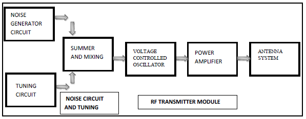
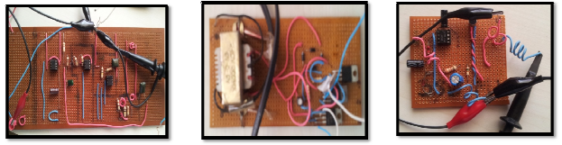
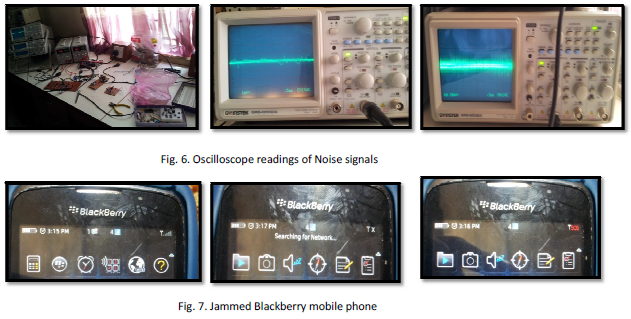

# mobile_jammer

## Introduction

Extrinsic noise is everywhere. Using a microphone and a Voltage controlled crystall oscillator, an RF circuit was built to jam cellular communications at the GSM band using destructive interference. 

## Description
A mobile phone jammer prevents communication with a mobile station or user equipment by
transmitting an interference signal at the same frequency of communication between a mobile station
and a base transceiver station. This project employs a system known as "active denial of service
jamming" whereby a noisy interference signal is constantly radiated into space over a target frequency
band and at a desired power level to cover a defined area. This jammer jams the downlink frequencies
of the global mobile communication band - GSM 900 MHz and the digital cellular band - DCS 1800
MHz using noise extracted from the environment.  
  
  

## Results
Successuly Jammed Blackberry mobile:  
  

